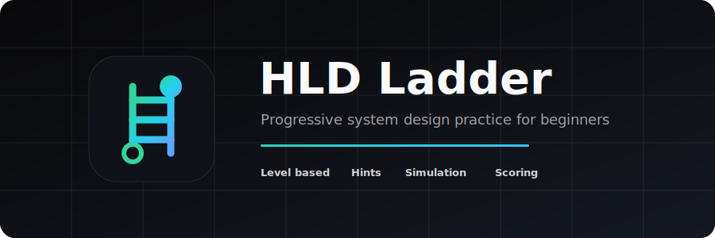

# HLD Ladder

A personal, progression-based system design practice app for learning high-level design from beginner foundations to interview-ready solutions.



Live app: https://hld-simulator-progressive.vercel.app/

## Why I Built This

Most system design prep is passive: videos, notes, and diagrams. HLD Ladder turns practice into an interactive loop:

1. Pick a level-based problem.
2. Build the architecture on a canvas.
3. Simulate production traffic.
4. Get scored across interview dimensions.
5. Use hints to fix weak areas and climb to the next level.

## Features

- Level-based practice progression for beginner, intermediate, advanced, and expert problems.
- Practice Coach panel with mastery progress, targets, recent attempts, and next-step hints.
- Company question discovery endpoint that can search recent web results and suggest three common HLD interview prompts for a company.
- Interactive React Flow canvas for dragging, wiring, annotating, saving, loading, and exporting designs.
- Traffic simulation with per-node utilization, bottlenecks, and throughput feedback.
- Scoring across scalability, availability, latency, cost, and trade-offs.
- Guided interview mode with timed phases for requirements, estimation, APIs, data model, HLD, and deep dive.

## Tech Stack

- Next.js 16 App Router
- React 19
- TypeScript
- Tailwind CSS 4
- React Flow via `@xyflow/react`
- Zustand persisted stores
- Vercel hosting

## Local Development

```bash
npm install
npm run dev
```

Open http://localhost:3000.

For verification:

```bash
npm run build
npx tsc --noEmit
```

## Deployment

This repo is hosted on Vercel and connected to GitHub. Pushes to `main` trigger a production deployment.